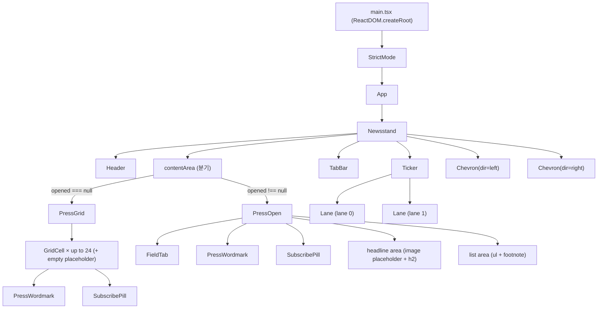
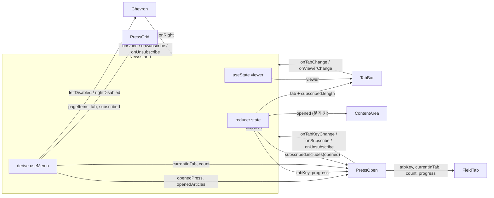

# 컴포넌트 계층 + props 흐름 설계 문서

> 사후 설계 문서. `src/main.tsx`, `src/App.tsx`, `src/components/**` 의 실제 코드를 직접 읽어 정리한다. PR 본문에 그대로 인용 가능한 형태.

---

## 1. 컴포넌트 트리

`src/main.tsx` 가 React StrictMode 안에서 `<App />` 를 마운트하고, `App` 은 `<Newsstand />` 단일 컨테이너만 렌더한다. 모든 도메인 상태와 사이드이펙트는 Newsstand 가 보유하며, 자식들은 props/콜백으로만 통신한다.

특이점:
- `Chevron` 은 `Newsstand` 직속으로 좌·우 두 개 — 콘텐츠 컬럼 바깥(거터)에 절대 배치되며, 트리상으로는 `PressGrid`/`PressOpen` 의 형제다.
- `PressGrid` 는 24 슬롯을 강제하기 위해 빈 슬롯에 `
` placeholder 를 채운다 (실제 `GridCell` 은 `items` 길이만큼).
- `Ticker` 는 두 `Lane` 을 비동기 오프셋으로 회전시키지만 자식 컴포넌트로 외부에 노출하지 않는다 (Ticker.tsx 안의 내부 함수 컴포넌트).

---

## 2. 컴포넌트 책임 + props/event 표

| 컴포넌트 | 책임 (한 줄) | 주요 props | 부모로 올리는 event | 내부 state |
|---|---|---|---|---|
| `App` | Newsstand 컨테이너 마운트만. | (없음) | (없음) | (없음) |
| `Newsstand` | 단일 도메인 컨테이너. reducer + viewer + 모든 derive + 자동 전환 + storage 동기화. | (없음 — 루트) | (없음) | `useReducer(state)` + `useState<ViewerId>("grid")` (= **viewer 는 reducer 가 아닌 useState 로 살아있다**) + `useMemo(today)` |
| `Header` | 좌측 브랜드(아이콘+제목) + 우측 날짜 표시. | `date: string` | (없음) | (없음) |
| `Ticker` | 두 레인 비동기 회전 티커. | (없음 — `ticker.json` 직접 import) | (없음) | (Lane 안에 `idx`, `hover`, `focus` `useState` 로 내장. Ticker 자신은 stateless) |
| `TabBar` | 탭(전체/구독) + 뷰어(리스트/그리드) 토글 바. | `activeTab`, `subCount`, `viewer`, `onTabChange`, `onViewerChange` | `onTabChange(tab)`, `onViewerChange(viewer)` | (없음 — 컨트롤드) |
| `PressGrid` | 24 슬롯 그리드. press → GridCell, 빈 슬롯 → placeholder. | `items`, `tab`, `subscribedIds`, `onOpen`, `onSubscribe`, `onUnsubscribe` | `onOpen(press)`, `onSubscribe(id)`, `onUnsubscribe(id)` | (없음) |
| `GridCell` | 한 칸. wordmark + hover/focus 시 SubscribePill. 클릭/Enter/Space 로 open. | `press`, `tab`, `subscribed`, `onOpen`, `onSubscribe`, `onUnsubscribe` | `onOpen()`, `onSubscribe()` 또는 `onUnsubscribe()` (mode 에 따라 분기) | (없음) |
| `PressWordmark` | 언론사 wordmark 를 타이포그래피로 렌더 (스펙 6.5 props 스키마). | `spec: PressWordmarkSpec` | (없음) | (없음 — 순수 표현) |
| `SubscribePill` | 구독/해지 pill 버튼. 클릭 시 `e.stopPropagation()` 후 콜백. | `mode`, `onClick` | `onClick()` | (없음) |
| `Chevron` | 좌/우 페이지·outlet 이동 버튼. `disabled` 시 visual hidden 이지만 layout 유지. | `dir`, `disabled`, `onClick` | `onClick()` | (없음) |
| `PressOpen` | 리스트 뷰. FieldTab(섹터 탭+진행바+카운터) + 헤드라인/기사 목록. | `press`, `articles`, `tabKey`, `currentInTab`, `count`, `progress`, `subscribed`, `onTabKeyChange`, `onSubscribe`, `onUnsubscribe` | `onTabKeyChange(key)`, `onSubscribe()`, `onUnsubscribe()` | (없음) |
| `FieldTab` | 카테고리 탭 6개 + 활성 탭의 6초 진행바 + `currentInTab/count` 카운터. | `tabKey`, `currentInTab`, `progress`, `count`, `onTabKeyChange` | `onTabKeyChange(key)` | (없음) |

핵심 관찰:
- **`viewer` 만 `useReducer` 바깥의 `useState` 로 분리되어 있다.** week1 의 #18 시점에서 도메인 상태(=리스트뷰 동작)와 토글 상태(=뷰어 선택)를 분리한 결과로 보인다. spec 9장의 NewsstandState 에는 `viewer` 가 없다 — 이것이 의도다.
- `Ticker` 는 prop 을 받지 않고 `ticker.json` 을 직접 import 한다. 부모와 결합하지 않는 자급자족 컴포넌트.
- `GridCell` 의 `tab` prop 은 현재 사용되지 않지만(실제 mode 분기는 `subscribed` 로 함) 호환을 위해 시그니처에 남아 있다 — 주석에 명시되어 있음.

---

## 3. 데이터 소유권 경계

| 데이터 | 소유 위치 | 비고 |
|---|---|---|
| `state` (`tab`, `page`, `opened`, `tabKey`, `progress`, `currentInTab`, `subscribed`) | `Newsstand` 의 `useReducer` (= 단일 진실 소스, spec 9장과 동일) | reducer 는 `src/state/newsstandReducer.ts` |
| `viewer` (`"grid" \| "list"`) | `Newsstand` 의 `useState<ViewerId>` | reducer 바깥. UI 토글이며 도메인 상태가 아니다 — 의도적으로 분리. |
| `today` (오늘 날짜 문자열) | `Newsstand` 의 `useMemo(formatToday)` | 마운트 시 1회 계산 |
| 파생: `visible`, `lastPage`, `safePage`, `pageItems`, `isOpened`, `openedPress`, `openedArticles`, `catOutlets`, `curIdxInCat`, `currentInTab`, `count` | `Newsstand` 안의 `useMemo` 또는 inline derive | week2 #3 에서 `selectors.ts` 로 추출 예정 |
| `ALL_PRESS` | `src/data/press.json` → `Newsstand` 모듈 스코프 import | 정적. 컴포넌트 인스턴스 라이프사이클과 무관 |
| `ALL_ARTICLES` | `src/data/articles.json` → `Newsstand` 모듈 스코프 import | 정적 |
| `ticker.json` | `Ticker` 가 직접 import | 단일 사용처 |
| `localStorage` (`newsstand:subscribed`) | `Newsstand` | hydrate: `useReducer` 의 init 함수에서 `loadFromStorage`. save: `useEffect([state.subscribed])` 에서 `saveToStorage`. 키: `"newsstand:subscribed"` |
| Lane 내부 (`idx`, `hover`, `focus`) | `Ticker` 안의 `Lane` (sub-component) | 도메인 상태 아님 — UI/입력 상태 |

원칙: **도메인 상태는 모두 `Newsstand` 의 reducer 1개**. 자식은 props/콜백만 받는 컨트롤드 컴포넌트. 예외는 `viewer`(UI 토글) 와 `Ticker`/`Lane` 내부의 회전 인덱스/포커스 상태처럼 부모와 공유할 이유가 없는 순수 표현 상태 두 군데 뿐.

---

## 4. props 흐름 다이어그램

핵심 흐름 4가지 (요청한 4개 확인):

1. **`tab` / `subscribed` → 분기·필터·카운트**
   - `state.subscribed.length` → `TabBar.subCount` (구독 배지)
   - `state.tab` → `Newsstand` 의 `visible` derive 입력 → `PressGrid.tab`
   - `state.subscribed` → `PressGrid.subscribedIds` (각 GridCell `subscribed` 계산), `PressOpen.subscribed` (열린 언론사가 구독 중인지)

2. **`opened` → grid vs open 분기**
   - `Newsstand` 의 `isOpened = state.opened !== null` 이 `contentArea` 안에서 삼항 분기 (`<PressOpen />` vs `<PressGrid />`).
   - 분기는 컨테이너 내부에서 일어나고 `Chevron` 두 개는 계속 같이 렌더된다 — `disabled` 만 모드에 따라 다르게 계산.

3. **`tabKey` / `currentInTab` / `progress` / `count` → PressOpen → FieldTab**
   - `tabKey`: reducer 직접 — `PressOpen` 을 거쳐 `FieldTab.tabKey`
   - `progress`: reducer 직접 — `FieldTab` 의 활성 탭 진행바 width
   - `currentInTab`: `Newsstand` 가 `catOutlets` + `curIdxInCat` 으로 derive — `FieldTab` 카운터 좌측
   - `count`: `Math.max(1, catOutlets.length)` — `FieldTab` 카운터 우측. (주의: reducer 의 `currentInTab` 필드가 아니라 derive 한 값을 내려보낸다.)

4. **페이지/outlet 이동 (Chevron) → Newsstand 의 `onLeft`/`onRight` → dispatch**
   - 모드에 따라 분기:
     - 그리드: `page/prev` / `page/next` dispatch
     - 리스트뷰(`isOpened`): 같은 `catOutlets` 안에서 인접 outlet 으로 `press/open` dispatch
   - `disabled` 도 같은 분기 — 그리드는 `safePage <= 0 / >= lastPage`, 리스트뷰는 `curIdxInCat === 0` 또는 마지막일 때.
   - 자동 전환은 별도 경로(`useInterval` 안에서 직접 dispatch) — Chevron 과 같은 액션을 사용하지만 진입점이 다르다.

---

## 5. 책임 경계 정리 (왜 이렇게 갈랐는가)

이 앱은 **단일 컨테이너(Newsstand)가 모든 도메인 상태(useReducer) + 사이드이펙트(localStorage hydrate/save, useInterval 자동 전환, 섹터 변경 시 자동 outlet 이동) + 모든 derive(visible, pageItems, catOutlets, currentInTab, count, leftDisabled, rightDisabled) 를 들고**, 자식 컴포넌트들(TabBar, PressGrid/GridCell, PressOpen, FieldTab, Chevron, PressWordmark, SubscribePill)은 **props 와 콜백만 받는 컨트롤드 stateless 컴포넌트**로 일관되게 갈랐다. 도메인 상태가 아닌 두 종류 — `viewer` UI 토글, 그리고 `Ticker.Lane` 의 회전 인덱스/포커스 — 만 자식 안 `useState` 로 살아있고, 둘 다 부모가 알 필요 없는 로컬 표현 상태라는 명확한 이유가 있다. 이 패턴은 **상태 추적 지점이 한 곳으로 단순화되고 자식 단위 단위 테스트가 props 만 fix 하면 끝나는 장점**을 주는 대신, **Newsstand.tsx 가 비대해지고 derive 로직이 inline 으로 쌓이는 단점**을 갖는다 — 그래서 week2 #3 에서 `selectors.ts` 추출, #4 에서 `useAutoAdvance` 훅 분리로 그 비대함만 제거한다 (구조는 유지).
