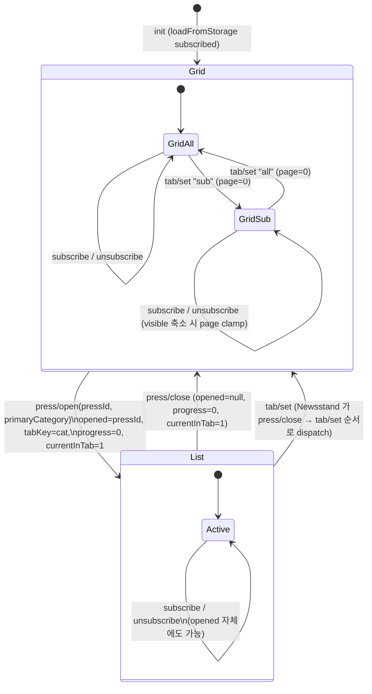

# State Flow + Action Diagram

뉴스스탠드의 단일 `useReducer` 가 어떤 상태를 들고, 어떤 액션이 어떤 전이를
일으키는지, 그리고 Newsstand 컨테이너가 그 상태를 어떻게 derive·effect 로
확장하는지 정리한다. spec/week2/spec.md 의 *상태 흐름 설계 필수* 충족.

대응 코드:

- `src/state/types.ts` (NewsstandState, CategoryKey)
- `src/state/newsstandReducer.ts` (NewsstandAction, initialNewsstandState, reducer)
- `src/components/Newsstand/Newsstand.tsx` (파생 상태 + 사이드이펙트)

---

## 1. 상태 형태 (State shape)

reducer 가 보유하는 도메인 상태. 스펙 9장 그대로.

| 필드 | 타입 | 의미 | 초기값 |
|---|---|---|---|
| `tab` | `"all" \| "sub"` | 상단 탭 (전체언론사 / 내가 구독한 언론사) | `"all"` |
| `page` | `number` | 그리드 모드의 0-indexed 페이지 번호 (현재 탭 스코프) | `0` |
| `opened` | `PressId \| null` | 리스트(상세) 뷰로 진입한 언론사. `null` 이면 그리드 모드 | `null` |
| `tabKey` | `CategoryKey` | 리스트 뷰 안의 활성 섹터(=카테고리) 키. CATEGORY_ORDER 중 하나 | `"general-economy"` |
| `progress` | `number` (0~1) | 리스트 뷰 활성 outlet 의 6초 진행 바. 0~1 클램프 | `0` |
| `currentInTab` | `number` | UI 표시용 "n/N" 의 n. **실 의미는 reducer 의 이 필드가 아니라 Newsstand 가 catOutlets 으로 재계산한 값**(§4 파생 상태) — reducer 필드는 press/open 시 1 로 reset 만 되고 사실상 사용되지 않는다. | `1` |
| `subscribed` | `PressId[]` | 구독한 언론사 id 배열. 순서 = 구독한 순서 (sub 탭 표시 순서와 일치) | `[]` (이후 localStorage hydrate) |

### reducer 바깥의 상태

- `viewer: "grid" \| "list"` — TabBar 의 그리드/리스트 토글. Newsstand.tsx 의
  `useState<ViewerId>("grid")` 로 관리. reducer 에 넣지 않은 이유:
  스펙 9장 상태 형태에 등장하지 않고, 영향 범위가 TabBar 의 토글 표시
  하나 뿐이라 별도 useState 가 더 가볍다. (URL sync 나 영구 저장이
  필요해지면 reducer 로 옮긴다 — §7.)

---

## 2. 액션 목록 + 효과

`NewsstandAction` union 의 모든 케이스. "reset 부가효과" 컬럼은 그 액션이
다른 필드도 같이 덮어쓰는 경우.

| 액션 | 페이로드 | 어떤 필드를 어떻게 바꾸는가 | reset 부가효과 |
|---|---|---|---|
| `tab/set` | `{ tab: "all" \| "sub" }` | `tab`= action.tab | `page` = 0. 같은 tab 이면 state 그대로 (idempotency). |
| `page/set` | `{ page: number }` | `page` = max(0, action.page) | — |
| `page/next` | — | `page` = state.page + 1 | — (상한은 Newsstand 의 lastPage 가드가 처리) |
| `page/prev` | — | `page` = max(0, state.page - 1) | — |
| `press/open` | `{ pressId, primaryCategory }` | `opened` = pressId, `tabKey` = primaryCategory | `progress` = 0, `currentInTab` = 1 |
| `press/close` | — | `opened` = null | `progress` = 0, `currentInTab` = 1 |
| `subscribe` | `{ pressId }` | `subscribed` = [...subscribed, pressId] | 이미 포함이면 state 그대로 (reference equality 보존) |
| `unsubscribe` | `{ pressId }` | `subscribed` = subscribed.filter(≠pressId) | 미포함이면 state 그대로 |
| `subscribed/hydrate` | `{ subscribed: PressId[] }` | `subscribed` = action.subscribed | 다른 필드는 모두 보존 |
| `field-tab/set` | `{ tabKey: CategoryKey }` | `tabKey` = action.tabKey | `progress` = 0, `currentInTab` = 1 |
| `field-tab/advance-current` | — | `currentInTab` = currentInTab + 1 | `progress` = 0. (현재 코드 경로상 dispatch 되지 않음. press/open 재발사로 흐름이 일원화됨 — §7) |
| `progress/set` | `{ progress: number }` | `progress` = clamp(0, 1, action.progress) | — |
| `progress/reset` | — | `progress` = 0 | — |

핵심 규칙:

- `press/open` 은 진입뿐 아니라 **리스트 뷰 안에서 다음 outlet 으로 점프**할
  때도 재사용된다. progress/currentInTab reset 이 동시에 일어나야 의미가
  맞기 때문에 별도 "next-outlet" 액션을 두지 않았다.
- `tab/set` 과 `field-tab/set` 은 페이지/진행도 reset 의미가 다르다.
  전자는 page 만 0, 후자는 progress + currentInTab.

---

## 3. 액션 → state 전이 다이어그램

진행 흐름의 핵심은 **`progress/set` 과 `press/open` 이 한 사이클을 이룬다**는
점이다. reducer 자체에는 "다음 outlet 으로" 라는 액션이 없고, Newsstand 의
useInterval 안에서 `state.progress + DELTA` 가 1 미만이면 progress/set,
이상이면 다음 outlet 의 press/open 을 dispatch 한다 (§5).

---

## 4. 파생 상태 표

Newsstand.tsx 가 useMemo / inline 으로 매 렌더 도출하는 값들.

| 파생 | 입력 | 정의 | 어디서 쓰임 |
|---|---|---|---|
| `visible` | `state.tab`, `state.subscribed`, `ALL_PRESS` | tab="all" → ALL_PRESS, tab="sub" → subscribed 순서대로 ALL_PRESS 에서 lookup (없는 id 는 drop) | 페이지·카테고리 도출의 진원지 |
| `lastPage` | `visible.length` | `max(0, ceil(visible.length / 24) - 1)` | Chevron disabled, page clamp |
| `safePage` | `state.page`, `lastPage` | `min(state.page, lastPage)` | pageItems 슬라이스, 화면에 실제로 보이는 페이지 |
| `pageItems` | `visible`, `safePage` | `visible.slice(safePage * 24, (safePage+1) * 24)` | PressGrid 에 props 로 전달 |
| `catOutlets` | `visible`, `state.tabKey` | `visible.filter(p => p.primaryCategory === state.tabKey)` | 리스트 뷰의 섹터=카테고리 의미 구현 (한 섹터 안의 outlet 들) |
| `curIdxInCat` | `catOutlets`, `state.opened` | `state.opened ? catOutlets.findIndex(p.id === opened) : -1` | 다음/이전 outlet 점프, Chevron disabled |
| `currentInTab` (파생) | `curIdxInCat` | `curIdxInCat >= 0 ? curIdxInCat + 1 : 1` | PressOpen 의 "n/N" 표시. **reducer 의 currentInTab 필드는 사용하지 않음** |
| `count` | `catOutlets` | `max(1, catOutlets.length)` | PressOpen 의 "n/N" 의 N |

spec 의 행동 매핑:

- "리스트 뷰 섹터 = 카테고리" (week1 #18 결정) → `catOutlets` 가 그 섹터의
  실재. count·current·자동 진행·셰브론이 모두 catOutlets 안에서 정의된다.
- "all 탭 = 72/24, sub 탭 = ceil(N/24) 페이지" → `lastPage` 계산.
- "구독 해지로 visible 가 줄어 page 가 끝을 넘기면 자동 보정" → `safePage` +
  page 오버플로 useEffect (§5).

---

## 5. 사이드이펙트

reducer 외부, Newsstand.tsx 가 책임지는 효과들.

- **localStorage hydrate**: `useReducer` 의 lazy init 함수가
  `loadFromStorage<PressId[]>("newsstand:subscribed", [])` 로 subscribed 만
  덮어써서 시작. (subscribed/hydrate 액션은 정의되어 있지만 현재 흐름에선
  lazy init 으로 충분해서 dispatch 되지 않는다.)
- **localStorage save**: `useEffect(() => saveToStorage(KEY, state.subscribed), [state.subscribed])` — 구독 변화마다 즉시 영속화.
- **자동 진행 (useInterval)**: `isOpened && !reduced` 일 때만 100ms 마다 콜백.
  `next = state.progress + 100/6000` 계산 후 `< 1` 이면 progress/set,
  `>= 1` 이면 같은 카테고리에 다음 outlet 이 있으면 그 outlet, 없으면
  `findNextCategoryWithOutlets` 로 다음 카테고리의 첫 outlet 을 press/open.
  이 한 곳이 6초 자동 전환의 전부.
- **page 오버플로 가드**: `useEffect(() => { if (state.page > lastPage) dispatch({ type: "page/set", page: lastPage }) }, [state.page, lastPage])`.
  visible 축소 (sub 탭 전환, 구독 해지) 후 page 가 범위를 넘기면 즉시 보정.
- **카테고리 자동 점프**: opened 인 상태에서 사용자가 field-tab/set 으로
  tabKey 만 바꾸면 그 카테고리에 opened 가 없을 수 있다. 이때
  `useEffect([isOpened, curIdxInCat, catOutlets])` 가 catOutlets[0] 으로
  press/open 을 dispatch 해 자연스럽게 이동.
- **prefers-reduced-motion**: `useReducedMotion` 이 true 면 useInterval 의
  delay 가 `null` 이 되어 자동 진행이 꺼진다. progress 는 그 자리에 멈추고,
  사용자가 셰브론으로 수동 이동만 가능.

---

## 6. 주요 시나리오 trace

### a. 사용자가 그리드에서 SBS Biz 를 클릭

전제: tab="all", page=0, opened=null, subscribed=[].

1. `dispatch press/open { pressId: "sbs-biz", primaryCategory: "broadcast-telecom" }`
2. reducer → `opened="sbs-biz"`, `tabKey="broadcast-telecom"`, `progress=0`, `currentInTab=1`
3. 다음 렌더에서 Newsstand 가 `catOutlets = visible.filter(primaryCategory==="broadcast-telecom")` 재계산
4. `curIdxInCat = catOutlets.findIndex(p.id==="sbs-biz")` (예: 2)
5. PressOpen 에 `currentInTab=3, count=catOutlets.length, progress=0` 으로 렌더
6. `isOpened=true && !reduced` 이므로 useInterval 활성화 (100ms 콜백 시작)

### b. 6 초 동안 자동 진행 → 다음 outlet

전제: 위 (a) 직후. catOutlets = [..., sbs-biz(2), kbs(3), mbc(4), ...].

- t=100ms: `next = 0 + 0.0167 = 0.0167 < 1` → `progress/set 0.0167`
- t=200ms: `next = 0.0167 + 0.0167 = 0.0333` → `progress/set 0.0333`
- ... (총 60 회 progress/set, 약 6 초)
- t≈6000ms: `next = ~0.9833 + 0.0167 = ~1.0`. `next < 1` 가지가 깨짐
  - `curIdxInCat = 2`, `catOutlets.length > 3` 이므로 `nextOutlet = catOutlets[3] = kbs`
  - `dispatch press/open { pressId: "kbs", primaryCategory: "broadcast-telecom" }`
  - reducer → opened=kbs, tabKey 그대로, progress=0, currentInTab=1
- 다음 렌더: curIdxInCat=3, currentInTab=4. 다시 0 부터 누적 시작.

카테고리 끝 시:

- 만약 sbs-biz 가 broadcast-telecom 의 마지막 outlet 이었다면,
  `findNextCategoryWithOutlets(visible, "broadcast-telecom")` 로 다음 카테고리
  (예: "it") 검색 → `visible.find(primaryCategory==="it")` 의 첫 outlet 으로
  press/open. tabKey 가 그 액션의 페이로드로 바뀌므로 섹터 탭도 자동 전환.

### c. 사용자가 sub 탭으로 전환 + 페이지 음수 시도

전제: tab="all", page=2, opened=null, subscribed=[a, b, c] (3 곳).

1. 사용자가 "내가 구독한 언론사" 탭 클릭 → onTabChange("sub")
   - `dispatch tab/set { tab: "sub" }` (isOpened=false 이므로 press/close 는 skip)
   - reducer → tab="sub", page=0
2. 같은 렌더 사이클의 derive:
   - `visible = [a, b, c]`, `lastPage = max(0, ceil(3/24) - 1) = 0`
   - `safePage = min(0, 0) = 0`, `pageItems = [a, b, c]`
3. 사용자가 왼쪽 셰브론을 눌러도:
   - `dispatch page/prev` → `page = max(0, 0 - 1) = 0` (idempotent)
   - 시각적으로는 leftDisabled=true 로 이미 disabled (Chevron 의 opacity:0).

만약 visible 축소로 page 가 lastPage 를 넘게 되는 케이스 (sub 탭 안에서
구독 해지로 visible.length 가 25 → 24 가 되어 lastPage 0 이 됐는데 page=1
이었던 경우):

- 다음 렌더에서 page 오버플로 useEffect 가 `dispatch page/set { page: 0 }` 발사
- 한 프레임 뒤 page=0 으로 보정. 사용자가 별도 입력할 필요 없음.

---

## 7. 설계 한계 / 확장 포인트

- `viewer` (grid/list 토글) 가 reducer 밖 useState 라 prop drilling 이 적지만
  영구 저장이나 URL sync 가 필요해지면 reducer 로 끌어올려야 한다.
- `currentInTab` 필드가 reducer 에 있지만 실제 표시는 Newsstand 가
  catOutlets 으로 재계산한 파생값이 차지한다 — 단일 진실 소스 원칙으로
  보면 필드를 제거하거나 (그리고 `field-tab/advance-current` 액션도) reducer
  안에서 catOutlets 를 알아야 한다. 후자는 reducer 가 press 카탈로그를
  알아야 해서 부적절하므로, 다음 정리에서 필드 제거 쪽이 자연스럽다.
- 자동 전환이 reducer 액션 한 개가 아니라 useInterval + dispatch(press/open)
  조합으로 구현돼 있어 컴포넌트가 비즈니스 로직을 들고 있다 — 이를
  `useAutoAdvance` 훅으로 분리하는 것이 #4 의 책임.
- `catOutlets` / `curIdxInCat` 계산이 매 렌더 O(n) — 24 개 수준이라 무시
  가능. 더 커지면 카테고리별 인덱스 맵으로 캐시.
- selectors 로 분리되지 않은 채 컴포넌트 안에 inline 으로 있어 단위
  테스트가 어렵다 — #3 가 `src/state/selectors.ts` 로 추출하면서 해결.
